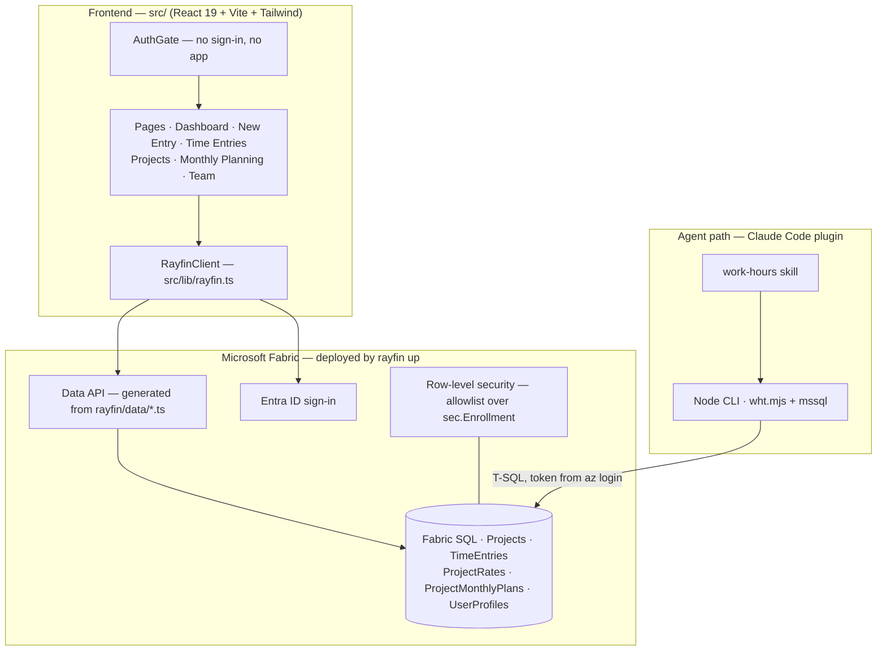

# Work hour tracker

Time tracking for a small consultancy, where the database — not the app — is the product surface: usable from a browser, from T-SQL, and from a Claude Code session.

Full write-up · completed August 2026 · [back to portfolio](../README.md)

[60-second demo](#TODO-demo-video) · [Architecture](#architecture) · [Results](#results-in-detail)

---

## The problem

Everyone tracked their own hours their own way. Three things broke as a result:

1. **No shared answer.** Per-client and per-month totals required collecting spreadsheets from people.
2. **Rewritten history.** When an hourly rate changed, the spreadsheet formula recalculated *everything* — including finished, invoiced work.
3. **Logging friction.** Time gets logged when it is cheap to log. Opening a file and finding the right row is not cheap; hours were reconstructed days later from memory.

## Outcome & recommendation

**Outcome**

- One Fabric SQL database holds projects, time entries, per-person rates and monthly plans behind Entra sign-in — reporting is a query, not a collection exercise.
- Two write paths, one data shape: the web app, and a Claude Code plugin ("log 3h on Acme today") driven by a Node CLI. Both stamp the same four owner columns, so rows written from the terminal are indistinguishable from rows written in the browser.
- Earnings are point-in-time correct: each time entry carries a frozen copy of the rate that applied when it was logged.
- Per-person data isolation is enforced in the database itself, not only in the app.

**Recommendation**

- **State the privacy boundary exactly, then close it.** The row-level policy is an *allowlist* over enrolled logins — an unenrolled login (workspace admin or owner) is not filtered at all. Enrol every colleague, and run `rls --status` before telling anyone their rows are private.
- **Finish the policy.** It covers 4 of the 5 owner-scoped tables; apply it to `ProjectShares` as soon as that table deploys.
- **Move the plugin repo to the organisation account.** It lives under a personal account today; the transfer keeps history, survives an owner leaving, and is a precondition for org-wide distribution.
- **Before adding analytics, add tests.** The next feature should not be the first thing this codebase relies on CI for.

## Architecture



The frontend is the only part written by hand. The database, the CRUD API, the auth service and the static hosting are generated from the TypeScript entity files in `rayfin/data/` by `rayfin up`.

## Tech stack

| Layer | Tool | Why chosen |
|---|---|---|
| UI | React 19 · Vite · Tailwind 4 | Fast HMR in development and a plain static build that Fabric hosting can serve without a Node server |
| Backend | Rayfin 1.33 (`@microsoft/rayfin-*`) | Entities are declared in TypeScript and compiled into tables plus a CRUD API — no hand-written CRUD to drift out of sync with the schema |
| Auth | Microsoft Entra ID (Fabric brokered sign-in) | The company identity already exists; no password is ever stored or handled |
| Storage | Fabric SQL (MSSQL) | Same tenant and capacity as the app, and reachable by ordinary T-SQL — which is what made the agent path possible at all |
| Agent interface | Claude Code plugin + Node CLI (`mssql`) | Fabric sign-in is irreducibly browser-based (no device-code or service-principal flow), so a terminal tool cannot reuse the app's API and must talk to SQL directly |
| Isolation | SQL row-level security | Enforcement had to live below the API, because the agent path bypasses the app's policies by construction |
| Credentials | `az account get-access-token`, minted per run | Nothing secret at rest: no passwords, no connection secrets in the repo |

## Data model

Five tables. Every data table carries the same four owner columns — `user_email`, `user_name`, `user_first_name`, `user_last_name` — written together on each insert.

| Table | Grain | Key columns |
|---|---|---|
| `Projects` | one row per person per project | `id`, `name`, `hourlyRate` *(suggested)*, `color` |
| `TimeEntries` | one row per person per project per logged block | `id`, `date`, `hours`, `hourlyRate` *(frozen copy)*, `notes`, `project_id` |
| `ProjectRates` | what one person charges on one project | `id`, `hourlyRate`, `project_id` |
| `ProjectMonthlyPlans` | one row per person per project per month | `id`, `month` (`YYYY-MM`), `plannedHours`, `project_id` |
| `UserProfiles` | one row per person | source of truth for their real name |

Two rules the model depends on:

- **`user_email` is the only real identity.** The name columns are display text — blank on older rows, and two people can derive the same name. Every read filters, groups and joins on the email.
- **Money lives in three places on purpose.** A project carries a *suggested* rate; a person's `ProjectRates` row is what they actually charge; and each time entry carries the rate frozen at logging time. Earnings therefore read as `COALESCE(t.hourlyRate, p.hourlyRate)`. The only event that re-stamps a frozen rate is moving an entry to a different project — the old copy is then the wrong project's money.

## Implementation

1. **Declare the data.** Entities in `rayfin/data/Project.ts` and `TimeEntry.ts`, listed in `schema.ts`; backend settings in `rayfin.yml`.
2. **Deploy the backend.** `rayfin up` creates the tables, the Data API, the auth service and the static site; generated settings flow `rayfin/.env` → `.env.local` → the frontend at runtime.
3. **Build the screens.** Dashboard (KPI cards), New Entry, Time Entries, Projects, Monthly Planning, Monthly Project Hours and Team — all behind an `AuthGate`, all data through one `RayfinClient`.
4. **Stamp ownership once.** `src/lib/user.ts` writes the four owner columns on every insert; the CLI mirrors the same logic so both paths agree.
5. **Build the agent path.** A `work-hours` Claude Code skill over `scripts/wht.mjs`: `whoami`, `projects`, `hours`, `summary`, `plans`, `add-entry`, `set-plan`, `edit-entry`, `edit-project`, `delete-entry`, and a read-only `query` escape hatch.
6. **Enforce isolation in SQL.** A row-level policy compiled from `rayfin/data/access.json` and applied with `rls --apply`; `rls --status` reports coverage.
7. **Onboard people.** An admin runs `grant-user --user <email>` once per colleague (table rights only, never `db_owner`); the colleague runs `az login --allow-no-subscriptions`, then `setup` and `whoami`.

## Quality & testing

Verified by hand end to end, from a clean install through to writes landing in the live database. The safety work sits in the tool design rather than in a test suite:

- `setup --check` walks the whole chain — az login → config → driver → token → connectivity → row ownership — and reports where it breaks.
- `--dry-run` on every write prints before → after without touching the database.
- `query` accepts a single `SELECT` only, rejects DML/DDL, and runs inside a transaction that always rolls back. It is a guard-rail against accidents, not a security boundary.
- Writes report the row count they actually affected and fail loudly on zero, so "it worked" is never inferred.
- `WHT_USER_EMAIL` is an optional guard-rail: if it disagrees with the connected identity, the CLI refuses to run rather than show the wrong person's data.

**Gap, stated plainly:** there is no automated test suite and no CI. That is the top item in [Limitations & next steps](#limitations--next-steps).

## Results in detail

- **Role-based authorisation was a dead end on this platform, and finding that out early saved building it twice.** *(measured)* Rayfin exposes exactly two roles, `anonymous` and `authenticated`; `claims.role` is defined only in `rayfin.yml`, which is static and app-wide; and API policies compare claims against columns on the same row, so "is this person a manager?" cannot be a subquery. Access control had to move down into SQL.
- **The policy had to be an allowlist, not a denylist.** *(measured)* Filtering every login would have caught the app's own database identity and blanked the app for every user simultaneously. It therefore filters only logins enrolled in `sec.Enrollment` — which is exactly why an unenrolled admin is still unfiltered. That limitation is a consequence of the design, not an oversight.
- **`SUSER_SNAME()` on a skill connection returns the real Entra UPN**, matching stored `user_email` values *(measured)* — the fact that makes SQL-side row filtering viable, and the reason the skill needs no per-person configuration.
- **Three defects surfaced only under real installation, not review** *(measured)*: a setup probe that called `process.exit` instead of throwing, so `setup` told the user to run `setup`; a `^11.0.1` dependency spec silently pinned to an exact version because Windows `cmd.exe` eats `^`; and a home directory containing a space arriving as two arguments under `shell: true` (Node DEP0190).
- **Plugin config cannot live beside the plugin.** *(measured)* Claude Code replaces the plugin cache directory wholesale on every version bump, and `$CLAUDE_PLUGIN_DATA` is not exported to skill-invoked bash — so the `~/.work-hours/` branch is what actually runs, not a fallback.

## Repository structure

```
work-hour-tracker/
├── src/                     frontend (hand-written)
│   ├── pages/               Dashboard · NewTimeEntry · TimeEntries · Projects · MonthlyPlanning · Team
│   ├── components/          AuthGate · Layout · KpiCard · FormField · ConfirmButton · charts
│   └── lib/                 rayfin.ts (API bridge) · user.ts (owner stamping) · hours.ts · rates.ts
├── rayfin/
│   ├── data/                entity declarations + access.json (RLS input)
│   └── rayfin.yml           backend settings
└── architecture.md          plain-English system map

agentic-work-tracker/        the Claude Code marketplace + plugin
└── plugins/work-tracker/
    └── skills/work-hours/   SKILL.md + scripts/wht.mjs (the CLI)
```

## Running it locally

```bash
# prerequisites: Node.js, Azure CLI, access to the Fabric workspace
az login --allow-no-subscriptions   # Entra-only account: the flag is required
npm install
npm run dev                         # deploys backend changes, then serves the frontend
```

```text
# the agent path, from Claude Code
/plugin marketplace add <org>/agentic-work-tracker
/plugin install work-tracker@agentic-work-tracker
node scripts/wht.mjs setup && node scripts/wht.mjs whoami
```

## Design decisions & trade-offs

| Decision | Rejected alternative | Why |
|---|---|---|
| Row-level security in SQL | Role-based API policies | The platform has no per-user role claim and its policies cannot subquery — the API layer physically cannot express "managers see everyone" |
| Allowlist policy over enrolled logins | Deny-by-default for all logins | Deny-by-default catches the app's own service identity and blanks the app for everyone; the cost is that unenrolled admins stay unfiltered, and that limit is documented rather than hidden |
| Frozen rate copied onto each entry | Join to the current rate at read time | A raise must not rewrite invoiced history; the duplication is the point |
| Per-person `Projects` rows | One shared project registry | Matches how the app writes data; the cost is that cross-person reports group on `p.name` + `user_email`, not `project_id` |
| `edit-entry` / `edit-project` in place | Delete and re-add | Delete-and-re-add silently discards the id, untouched notes and the frozen rate |
| Config in `~/.work-hours/` | Config beside the plugin | The plugin directory is deleted and re-copied on every version bump |
| Direct SQL for the agent path | Reuse the app's Data API | Fabric sign-in is browser-only — no device-code or service-principal flow exists for a terminal tool |

## Limitations & next steps

- **No automated tests or CI.** Every defect so far was found by installing and using the thing. First priority.
- **Row-level security covers 4 of 5 tables** — `ProjectShares` is not deployed yet; apply the policy when it is.
- **Manager visibility is a literal email list** compiled into the policy. Fine for one team, wrong past a handful of people.
- **Unenrolled logins are not filtered.** Workspace admins and owners read everything, by design of the allowlist.
- **Onboarding is manual**: Node, the Azure CLI, and a one-off database grant per person.
- **This is an OLTP application, not a pipeline.** The natural next build is the analytics layer — a scheduled aggregate of hours and earnings into a Fabric lakehouse, with freshness and quality checks.


---

[back to portfolio](../README.md)
