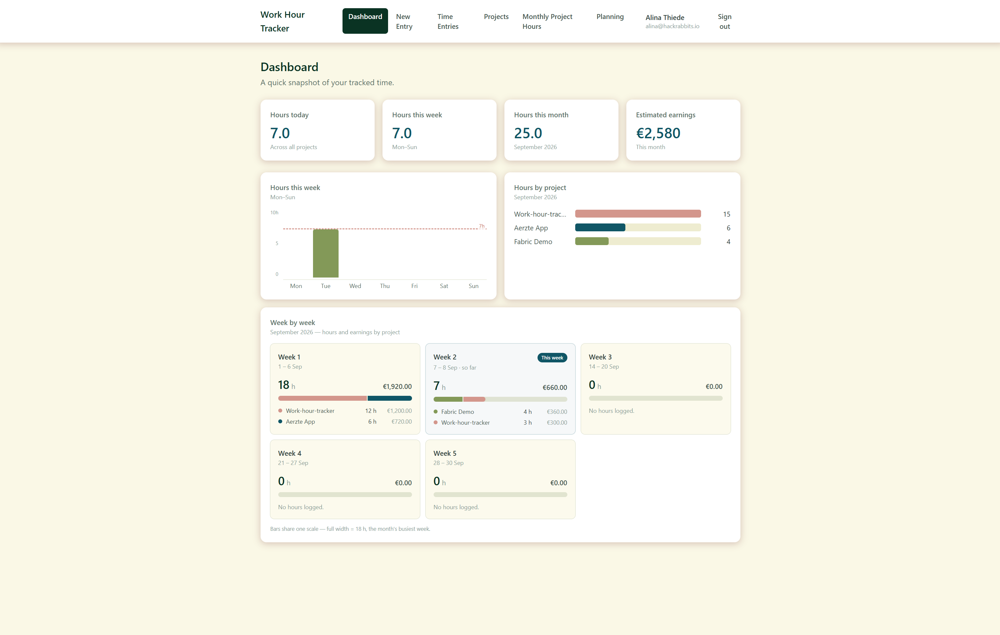
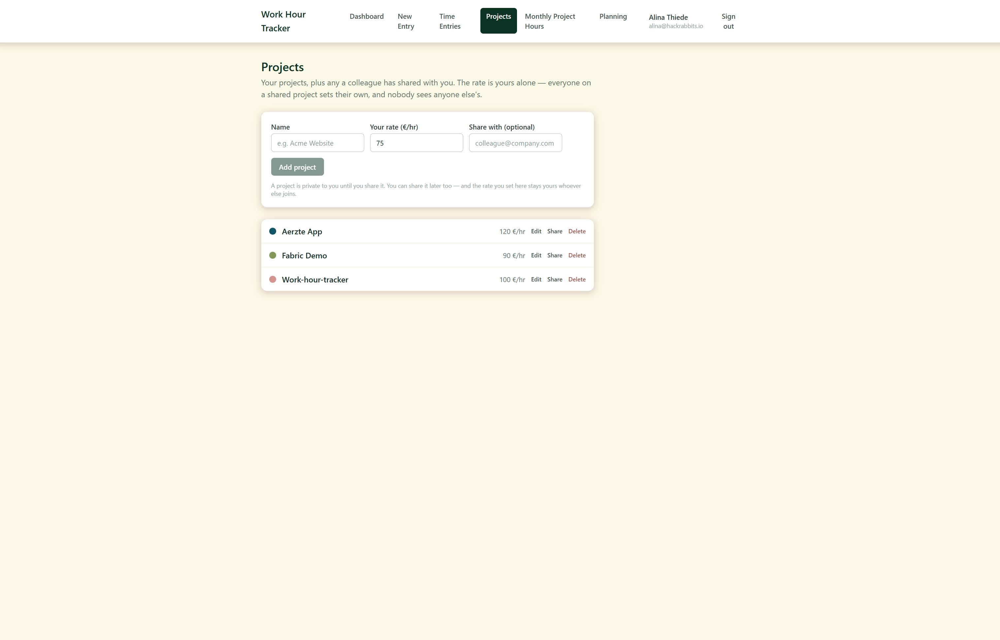
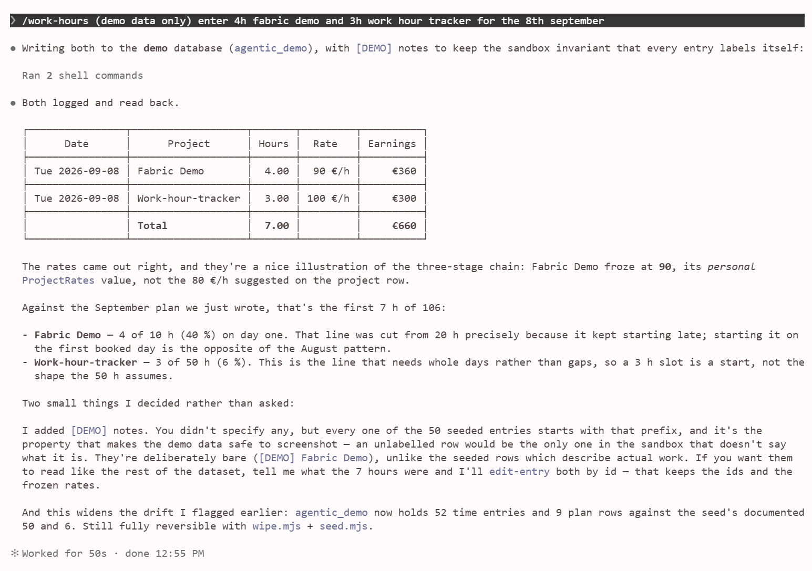

# Work hour tracker

How a small consultancy moved its billable hours out of scattered spreadsheets and into one shared database — and what it took to keep everyone's numbers private and correct.

*Completed August 2026* · [back to portfolio](../README.md)

**Chapters** · [One place for everyone's hours](#one-place-for-everyones-hours) · [A raise shouldn't rewrite last year](#a-raise-shouldnt-rewrite-last-year) · [Logging hours by just saying so](#logging-hours-by-just-saying-so) · [Your hours are yours](#your-hours-are-yours) · [What I'd tell the next person](#what-id-tell-the-next-person)

> **The short version**
>
> **Outcome** · The whole team's hours, rates and monthly plans now live in one database on Microsoft Fabric. People log time in a web app, or by typing a sentence to an AI assistant, and both end up in exactly the same place.
>
> **Finding** · Building the app was the easy half. The hard half was keeping one privacy rule true through two different doors into the data: the app, and direct access to the database.
>
> **Recommendation** · Treat the database, not the app, as the privacy boundary, and enrol every colleague in its rules before promising anyone that their hours are private.

> **Why there is nothing to click.** The app runs inside a company's Microsoft Fabric workspace, behind company sign-in, on real billing data, so there is no public link to hand you. Every screenshot here was taken against a demo database whose every row is invented. No source code is published — see [NOTICE](../NOTICE.md).

---

At the end of every month, a small consultancy needed the answer to one simple question: *how many hours did we put on this client, and what are they worth?*

Nobody could answer it quickly. Everyone kept their hours in their own spreadsheet, in their own way, so the answer meant collecting files from colleagues and adding them up by hand.

The spreadsheets had two quieter problems as well. Changing an hourly rate recalculated every row — including work that had already been invoiced — so last year's money could change without anyone noticing. And because opening the file and finding the right row took effort, hours were often written down days later, from memory.

This is the story of replacing those spreadsheets, and of the part that turned out to be far harder than building the app.

## One place for everyone's hours

The answer was a web app: each person logs their hours against a project, and a dashboard adds everything up on its own.

*The dashboard — this week as a bar chart, hours per project, and what they earned. Every number comes from the invented demo data.*

It runs on **Microsoft Fabric**, Microsoft's platform for company data. That choice mattered for two reasons. The company already signs in with Microsoft accounts, so the app never sees or stores a password — you sign in exactly the way you sign in to Outlook. And the hours land in a real SQL database inside the company's own cloud, which can be asked questions directly, without going through the app at all.

The surprising part is how little had to be written by hand. I described the data — a project has a name and a colour, a time entry has a date, a number of hours and a note — and a tool called **Rayfin** turned that description into the database tables, the web API the app talks to, the sign-in, and the hosting. The only part I wrote myself is the part you see: seven pages, from the dashboard and the entry form to a monthly plan and a view for the manager.

→ **[Technical details: One place for everyone's hours](work-hour-tracker/app.md)** — every screen, the architecture diagram, the tech stack and why each piece was chosen

## A raise shouldn't rewrite last year

In a spreadsheet, the hourly rate is one cell. Change it, and every formula that uses it recalculates — including work that was invoiced months ago.

So the tracker never looks the rate up later. The moment you log an hour, it writes down the rate that applies right then, on that entry, and keeps it. Raise your rate tomorrow and only tomorrow's hours get the new price; everything already logged keeps the money it actually earned.

The same thinking decided who owns what. A project is shared, because everyone works for the same clients. A rate is personal: two people on one project can charge different amounts, and neither can see the other's. That is why the rate lives in its own table instead of on the project — if it sat on the project, sharing the project would share the money too.

*The Projects page — the rate shown is yours alone, whoever else works on the same project.*

One small rule protects all of this: entries are edited, never deleted and added again. A re-added entry would pick up today's rate and quietly change what old work was worth.

→ **[Technical details: A raise shouldn't rewrite last year](work-hour-tracker/data-model.md)** — the six tables, the three places a rate lives, and the code that keeps them in agreement

## Logging hours by just saying so

Opening a web page to log two hours is still a small chore. So there is a second way in: you type a sentence to an AI assistant — *"log 3 hours on Fabric Demo today"* — and it is done.

This runs in **Claude Code**, an AI assistant that works in the terminal. I gave it three **skills**: written instructions plus a small program that talks to the same database as the app. Rows written this way look exactly like rows written in the browser.

*Two entries logged with one sentence each, then read back from the database to prove they landed.*

- **`work-hours`** logs, edits and summarises hours. After every change it reads the data back, instead of just saying "done".
- **`monthly-statement`** turns a month of hours into the documents a month ends with: the billing statement, and the working-time record Austrian law requires. Before it starts, it asks the questions that would make the document wrong if guessed — such as which VAT rate applies.
- **`month-planning`** reviews last month, then asks how to plan the next one. In the demo it noticed, without being asked, that four Fridays had no hours at all — and asked whether that was on purpose, because the answer changes the whole plan.

The rule I care most about is the one all three follow: **the AI calculates nothing by hand.** Every number comes from the program, and the statement checks its own totals against a second, independent query before it reports anything. A document where the AI did the maths is a document nobody can check.

→ **[Technical details: Logging hours by just saying so](work-hour-tracker/agentic-layer.md)** — all three skills step by step, and how the database connection decides who you are · **[The documents they produced →](work-hour-tracker/samples/)**

## Your hours are yours

Everyone's hours in one place raises an obvious question: who can see them? The rule fits in one sentence. **You see your own hours, the manager sees everyone's, and nobody can change anyone else's — the manager included.** A manager may look, never touch.

Writing that rule down was easy. Keeping it true was not, because there are now two doors into the data. The app is one door, and it checks the rule before it shows anything. The AI assistant is the other: it goes straight to the database and never passes through the app's checks. A rule that guards only one door does not guard anything.

So the rule is enforced twice — once in the app, and once in the database itself, where it applies no matter how someone gets in. To stop the two copies from slowly drifting apart, both are generated from one small file, and a status command compares them and complains when they no longer match. In the database, that one sentence became 25 separate rules across the five tables that hold personal data *(measured)*.

I also wrote down where the protection ends, instead of hiding it. The names of projects are visible to everyone who can sign in, even projects they do not work on. And the database rules protect colleagues from each other, not from the people who administer the workspace: the app itself connects to the database as the workspace owner, a real person, so a rule strict enough to catch administrators would lock the app out for everybody. The fix is known — give the app an account of its own.

→ **[Technical details: Your hours are yours](work-hour-tracker/security.md)** — the rule as code in both layers, the five kinds of database rule and what each one stops, and both exceptions in full

## What I'd tell the next person

The spreadsheets are gone. Hours, rates and plans live in one database; a monthly total is a question you ask it, not a pile of files you collect; and last year's earnings stay exactly what they were.

If someone picked this project up tomorrow, I would tell them four things:

1. **The database is the real privacy boundary, not the app.** Before promising anyone their hours are private, add every colleague to the database rules and run the status check.
2. **Give the app its own account.** Most of the exceptions above exist because the app runs as a person. With an account of its own, the last gap in the rules can close.
3. **Add automated tests before adding features.** Everything so far was checked by hand, and every bug so far was found by installing and using the tool for real. That does not scale.
4. **Move the assistant's code into the company's account.** It still lives under a personal account, which would not survive its owner leaving.

The next thing I would build is the analytics layer: a scheduled job that summarises hours and earnings into a Fabric lakehouse — Fabric's store for analysis data — with checks that the numbers are fresh and correct. The tracker collects the data; that layer would turn it into answers.

→ **[Technical details: What I'd tell the next person](work-hour-tracker/lessons.md)** — the design decisions and what was rejected, how the work was checked, the findings in detail, and every known limitation

---

[back to portfolio](../README.md)
