# Work hour tracker

Time tracking for a small consultancy, where the database — not the app — is the product surface: usable from a browser, from T-SQL, and from a Claude Code session.

Full write-up · completed August 2026 · [back to portfolio](../README.md)

**[Screens](#screens)** · **[Claude Code skills](#claude-code-skills)** · **[Architecture](#architecture)** · **[Results](#results-in-detail)** · **[Security deep-dive →](work-hour-tracker/security.md)** · **[The incident →](work-hour-tracker/data-incident.md)**

> **Why there is nothing to click.** The app runs inside a Microsoft Fabric workspace, behind Entra sign-in, on a working consultancy's billing data. There is no anonymous URL to hand you. What follows instead: annotated screenshots of the app and of the agent tooling, taken against a **demo database whose every row is invented** and whose every time entry labels itself `[DEMO]`. No source code is published — see [NOTICE](../NOTICE.md).

---

## The problem

Everyone tracked their own hours their own way. Three things broke as a result:

1. **No shared answer.** Per-client and per-month totals required collecting spreadsheets from people.
2. **Rewritten history.** When an hourly rate changed, the spreadsheet formula recalculated *everything* — including finished, invoiced work.
3. **Logging friction.** Time gets logged when it is cheap to log. Opening a file and finding the right row is not cheap; hours were reconstructed days later from memory.

## Outcome & recommendation

**Outcome**

- One Fabric SQL database holds projects, time entries, per-person rates and monthly plans behind Entra sign-in — reporting is a query, not a collection exercise.
- Two write paths, one data shape: the web app, and a Claude Code plugin ("log 3h on Acme today") driven by a Node CLI. Both stamp the same four owner columns, so rows written from the terminal are indistinguishable from rows written in the browser.
- Earnings are point-in-time correct: each time entry carries a frozen copy of the rate that applied when it was logged.
- Per-person data isolation is enforced in the database itself, not only in the app.

**Recommendation**

- **State the privacy boundary exactly, then close it.** The row-level policy is an *allowlist* over enrolled logins — an unenrolled login (workspace admin or owner) is not filtered at all. Enrol every colleague, and run `rls --status` before telling anyone their rows are private.
- **Give the app its own service principal.** The whole allowlist exists because the app's data backend connects to SQL as the *workspace owner* — a real person — so a deny-by-default policy would catch it and blank the app for everyone. With a service principal, that person can be enrolled like anybody else and the policy can close. *(The policy itself is now complete: 25 predicates across all 5 owner-scoped tables — see the [security deep-dive](work-hour-tracker/security.md).)*
- **Move the plugin repo to the organisation account.** It lives under a personal account today; the transfer keeps history, survives an owner leaving, and is a precondition for org-wide distribution.
- **Before adding analytics, add tests.** The next feature should not be the first thing this codebase relies on CI for.

## Screens

*All screenshots are of the running app, signed in against the demo database. Every note visible in the data begins with `[DEMO]` — that prefix is a property of the seeded dataset, and it is why these screenshots can be published at all.*

**Dashboard** — four KPIs, the week as a bar chart, hours by project in each project's own stored colour, and week-by-week small multiples where hours are *drawn* and money is *written*, so two measures share a card without sharing a scale. All five week cards share one maximum, so the weeks compare honestly.


**Monthly project hours** — the plan/actual view. A scatter of planned against actual with the dashed *actual = planned* diagonal and a least-squares trend line, progress rings that turn rosy when a project goes over plan, and the same numbers again as a table because a gauge is not a figure you can check.

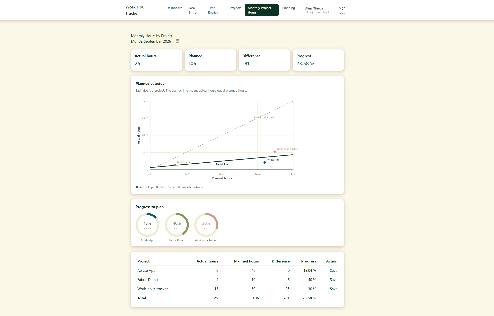

**Time entries** — everything logged, newest first, editable in place. `Edit` rather than delete-and-re-add is a deliberate constraint: re-adding an entry would lose its id, its notes and its frozen rate, silently repricing old work at today's rate.

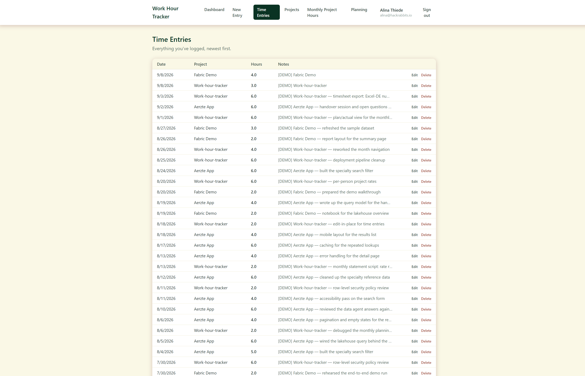

**Projects** — where the rate model becomes visible. The rate is *yours*: everyone on a shared project sets their own, and nobody sees anyone else's. Sharing is a separate act from creating, and the rate you set stays yours whoever else joins.


**Monthly planning** — planned hours per project per month, saved as soon as a cell loses focus.

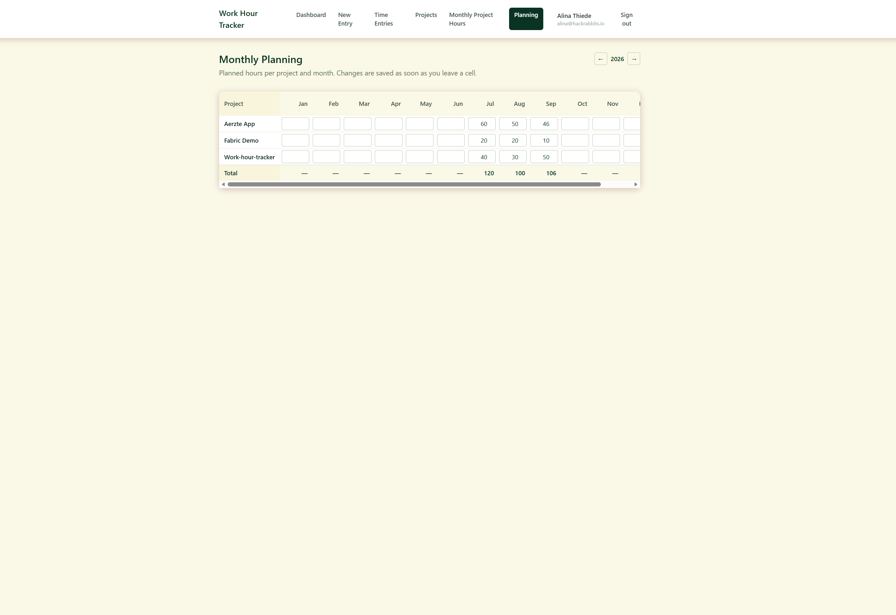

<details>
<summary>Two more — new entry, and the sign-in gate</summary>

**New time entry.** The rate in force is resolved and frozen onto the row at this moment, which is what makes historical earnings immutable.

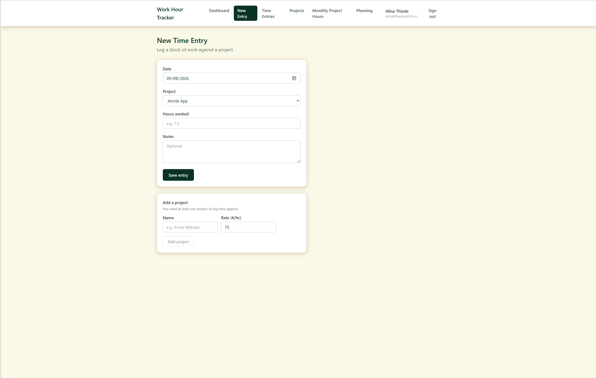

**The sign-in gate.** No password is ever handled by this app — sign-in is brokered to Microsoft Entra ID through the Fabric portal.


</details>

## Claude Code skills

The screens above are one way into this data. This is the other: three [Claude Code](https://claude.com/claude-code) skills that read and write the same Fabric SQL database from a terminal conversation — and, for two of them, produce a finished document at the end of it.

**Why they go underneath the app rather than through it.** The deployed Data API only supports interactive browser sign-in — there is no device-code flow and no service principal a command-line tool could use. So the skills sit *beneath* it and talk to Fabric SQL directly, through one 1 790-line Node CLI:

```
   Person, in Claude Code                 ┌── az login (as themselves)
        │  "log 3h on Fabric Demo today"  │   short-lived Entra token,
        ▼                                 │   no stored password
   the work-hours CLI ─────────────────────┘
        │  identity = SUSER_SNAME() from the CONNECTION, never from config
        ▼
   Fabric SQL ── filtered by row-level security
```

Two consequences, both deliberate. **Nobody can become someone else by editing a text file** — the caller's identity comes from the authenticated database connection, so colleagues share one checkout and each sees only their own hours, with no per-person setup. And because this path bypasses the app's policy engine by construction, [the database needed its own copy of the access rule](work-hour-tracker/security.md).

Every screenshot below is a real run against the demo database.

---

### 1 · `work-hours` — read and write

The general-purpose one. Projects, time entries and monthly plans: list, add, edit, delete, summarise by project, day, week or month, plus a fenced read-only SQL escape hatch for anything the fixed commands do not cover.


Two things in that run matter more than the write itself.

**It reads back what it wrote**, rather than reporting success from an exit code — and the read-back is where the three-stage rate model becomes visible: Fabric Demo froze at **90 €/h**, the *personal* `ProjectRates` value, not the 80 €/h suggested on the project row.

**It reported its own side effects.** It flagged that it had added the `[DEMO]` prefix without being asked and said why, and it noticed the sandbox had drifted from its documented seed — 52 entries and 9 plan rows against a documented 50 and 6 — and named the two commands that restore it. Neither was requested. An agent with database write access that only tells you what you asked about is an agent you cannot audit.

---

### 2 · `monthly-statement` — the billing and statutory documents

Turns a month of time entries into four files: the billing statement, the Austrian statutory working-time record, and both as data.

**It asks before it runs, and prices every option.** A wrong VAT rate makes the whole document unusable, so it is a question rather than a default — with each answer's consequence worked out before you choose:

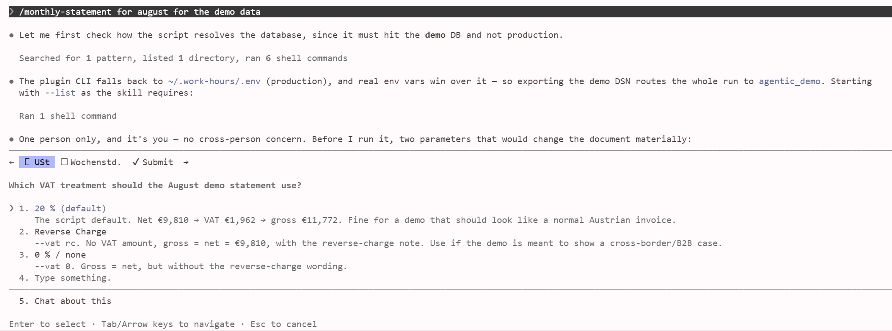

**Then it checks its own work against an independent query:**

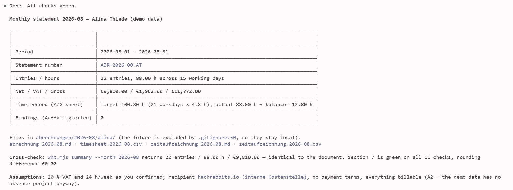

The number that matters there is not the €9,810. It is the line beneath it — the document's totals re-derived by a **different command** (`wht.mjs summary --month`) and compared: 22 entries, 88.00 h, identical, rounding difference €0.00, all 11 internal checks green.

That is the rule the skill enforces on the model driving it: **calculate nothing by hand.** Every number in the document comes from the script's JSON output; anything missing is written in as an open point, never estimated. A report where the model did the arithmetic is a report nobody can check.

#### What it produced

| Document | What to look at |
|---|---|
| **[`abrechnung-demo-2026-08.md`](work-hour-tracker/samples/abrechnung-demo-2026-08.md)** | The billing statement. **Section 7** is the reason to open it: eleven plausibility checks, each stated and ticked — nothing on an Austrian public holiday, no weekend bookings, no day over 12 h, and a reconciliation proving timesheet = task = project = total at **0,00 € rounding difference**. Then seven numbered assumptions, including the honest one — *the schema has no task entity, so the description is used as the task* |
| **[`zeitaufzeichnung-demo-2026-08.md`](work-hour-tracker/samples/zeitaufzeichnung-demo-2026-08.md)** | The statutory record — a *Saldenaufzeichnung* under **§ 26 Abs 3 AZG**, which permits recording only the duration worked per day. 21 working days × 4,8 h = **100,80 h target** against **88,00 h actual**, balance **−12,80 h** to payroll. Its notes flag that one day exceeded six hours, obliging a § 11 break that a balance record does not capture |
| **[`timesheet-demo-2026-08.csv`](work-hour-tracker/samples/timesheet-demo-2026-08.csv)** · **[`zeitaufzeichnung-demo-2026-08.csv`](work-hour-tracker/samples/zeitaufzeichnung-demo-2026-08.csv)** | The same content as data. German-Excel compatible — UTF-8 with BOM, semicolons, decimal commas, CRLF |

Both formats of the working-time record render from **one** model, so they cannot disagree. **Markdown and CSV only — never HTML or PDF**: one renderer per document means there is no second generator to drift out of step with the first.

---

### 3 · `month-planning` — review, then questions, then plan

Three steps in a fixed order, and the order is the design. **The questions come after the review, because the review is what makes them answerable** — asking first is asking into the dark.

The script computes every number: working days, deviations, fulfilment rates, trends, and its own warnings. The narrative half — *what was actually achieved* — is written from the notes on the entries, and that half is the model's job.

Then four questions, and **every option carries the number behind it**:

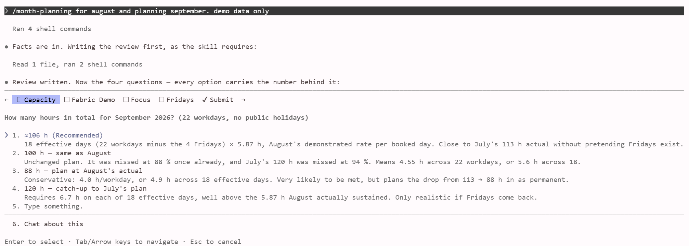

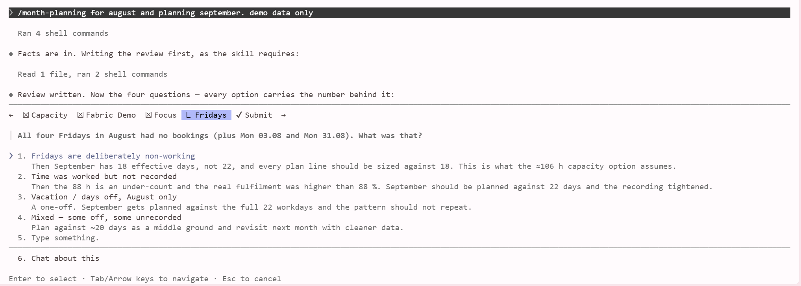

That second one is the interesting one. Nobody asked it to look for empty weekdays; the script flags `unbooked-workdays` by itself, and the answer changes the arithmetic of the entire plan — four non-working Fridays means September has **18 effective days, not 22**, and every line gets sized against 18.

<details>
<summary>The other two questions — a chronically missed project, and where the focus should go</summary>

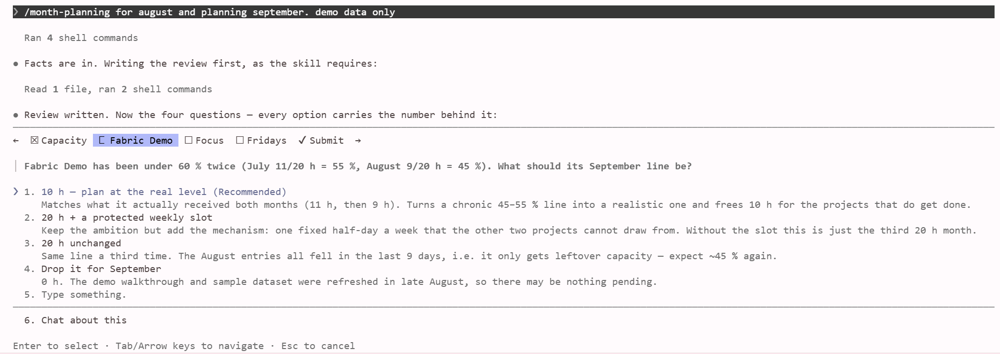

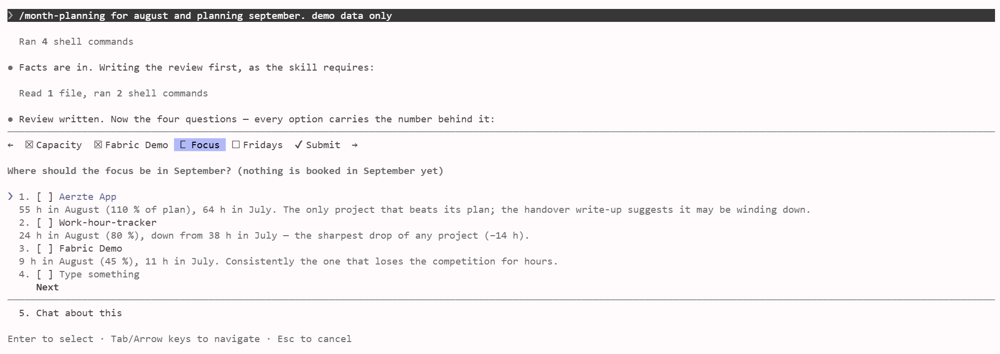

</details>

**Writing the plan back**, with a seatbelt: `--total` is the expected sum, and if the distribution does not add up to it, **nothing is written at all**. Afterwards the rows are read back out of the database and compared.

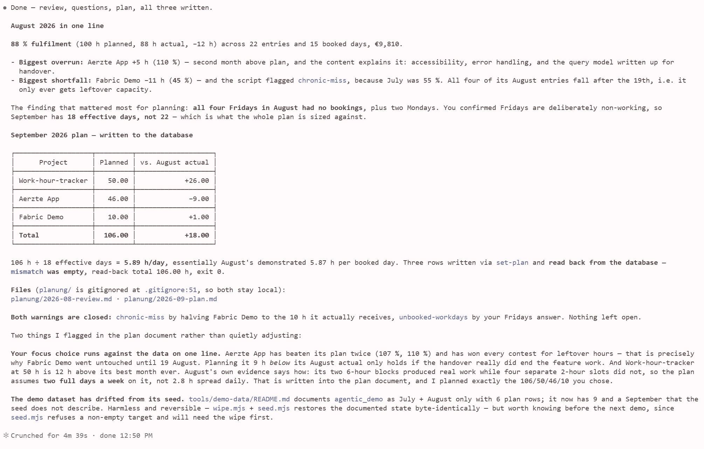

It also did two things it was not asked to do, and *announced* both rather than performing them quietly: it pushed back on the focus choice, pointing out that the chosen project had won every contest for leftover hours in both prior months; and it recorded the evidence for how the hours should be shaped — two six-hour blocks produced real work in August while four separate two-hour slots did not, so the plan assumes two full days a week rather than 2.8 hours spread daily. **An agent that quietly adjusts your numbers is worse than one that refuses.**

#### What it produced

| Document | What to look at |
|---|---|
| **[`planungsreview-demo-2026-08.md`](work-hour-tracker/samples/planungsreview-demo-2026-08.md)** | The review. **Section 3** — *what was achieved* — is the half written from the entry notes rather than computed, and it is where the split between script and model is easiest to see: it reads eleven entries and concludes a feature went from working to finished, which is not something a query can say |
| **[`monatsplan-demo-2026-09.md`](work-hour-tracker/samples/monatsplan-demo-2026-09.md)** | The plan that came out of it and was written to the database — including the two objections above, recorded as flags rather than applied as edits |

---

All six documents, with their framing: **[samples/ →](work-hour-tracker/samples/)** · The design detail behind the skills — the identity rule, the SQL escape hatch and how it is fenced: **[the agent layer →](work-hour-tracker/agentic-layer.md)**

## Architecture

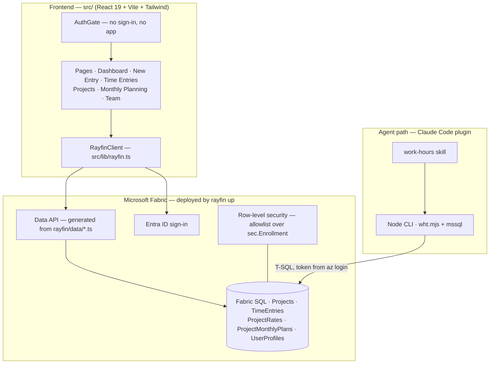

The frontend is the only part written by hand. The database, the CRUD API, the auth service and the static hosting are generated from the TypeScript entity files in `rayfin/data/` by `rayfin up`.

## Tech stack

| Layer | Tool | Why chosen |
|---|---|---|
| UI | React 19 · Vite · Tailwind 4 | Fast HMR in development and a plain static build that Fabric hosting can serve without a Node server |
| Backend | Rayfin 1.33 (`@microsoft/rayfin-*`) | Entities are declared in TypeScript and compiled into tables plus a CRUD API — no hand-written CRUD to drift out of sync with the schema |
| Auth | Microsoft Entra ID (Fabric brokered sign-in) | The company identity already exists; no password is ever stored or handled |
| Storage | Fabric SQL (MSSQL) | Same tenant and capacity as the app, and reachable by ordinary T-SQL — which is what made the agent path possible at all |
| Agent interface | Claude Code plugin + Node CLI (`mssql`) | Fabric sign-in is irreducibly browser-based (no device-code or service-principal flow), so a terminal tool cannot reuse the app's API and must talk to SQL directly |
| Isolation | SQL row-level security | Enforcement had to live below the API, because the agent path bypasses the app's policies by construction |
| Credentials | `az account get-access-token`, minted per run | Nothing secret at rest: no passwords, no connection secrets in the repo |

## Data model

Six tables. Every data table carries the same four owner columns — `user_email`, `user_name`, `user_first_name`, `user_last_name` — written together on each insert.

| Table | Grain | Key columns |
|---|---|---|
| `Projects` | one row per project, **shared** — its `user_email` is a *created by* label, not an owner | `id`, `name`, `hourlyRate` *(suggested)*, `color` |
| `TimeEntries` | one row per person per project per logged block | `id`, `date`, `hours`, `hourlyRate` *(frozen copy)*, `notes`, `project_id` |
| `ProjectRates` | what one person charges on one project | `id`, `hourlyRate`, `project_id` |
| `ProjectShares` | one project made visible to one other person | `id`, `project_id`, `shared_with` *(the invitee)*, `user_email` *(the sharer)* |
| `ProjectMonthlyPlans` | one row per person per project per month | `id`, `month` (`YYYY-MM`), `plannedHours`, `project_id` |
| `UserProfiles` | one row per person | source of truth for their real name; doubles as the team roster |

None of those grains is a database constraint — the platform offers no `unique` option — so each is enforced in application code. That turned out to matter far more than expected: the `ProjectMonthlyPlans` grain, `(user_email, month, project_id)`, later became the only way to reconcile two diverged copies of the database. See [the incident](work-hour-tracker/data-incident.md).

Two rules the model depends on:

- **`user_email` is the only real identity.** The name columns are display text — blank on older rows, and two people can derive the same name. Every read filters, groups and joins on the email.
- **Money lives in three places on purpose.** A project carries a *suggested* rate; a person's `ProjectRates` row is what they actually charge; and each time entry carries the rate frozen at logging time. Earnings therefore read as `COALESCE(t.hourlyRate, p.hourlyRate)`. The only event that re-stamps a frozen rate is moving an entry to a different project — the old copy is then the wrong project's money.

## Implementation

1. **Declare the data.** Entities in `rayfin/data/Project.ts` and `TimeEntry.ts`, listed in `schema.ts`; backend settings in `rayfin.yml`.
2. **Deploy the backend.** `rayfin up` creates the tables, the Data API, the auth service and the static site; generated settings flow `rayfin/.env` → `.env.local` → the frontend at runtime.
3. **Build the screens.** Dashboard (KPI cards), New Entry, Time Entries, Projects, Monthly Planning, Monthly Project Hours and Team — all behind an `AuthGate`, all data through one `RayfinClient`.
4. **Stamp ownership once.** `src/lib/user.ts` writes the four owner columns on every insert; the CLI mirrors the same logic so both paths agree.
5. **Build the agent path.** A `work-hours` Claude Code skill over `scripts/wht.mjs`: `whoami`, `projects`, `hours`, `summary`, `plans`, `add-entry`, `set-plan`, `edit-entry`, `edit-project`, `delete-entry`, and a read-only `query` escape hatch.
6. **Enforce isolation in SQL.** A row-level policy compiled from `rayfin/data/access.json` and applied with `rls --apply`; `rls --status` reports coverage.
7. **Onboard people.** An admin runs `grant-user --user <email>` once per colleague (table rights only, never `db_owner`); the colleague runs `az login --allow-no-subscriptions`, then `setup` and `whoami`.

## Quality & testing

Verified by hand end to end, from a clean install through to writes landing in the live database. The safety work sits in the tool design rather than in a test suite:

- `setup --check` walks the whole chain — az login → config → driver → token → connectivity → row ownership — and reports where it breaks.
- `--dry-run` on every write prints before → after without touching the database.
- `query` accepts a single `SELECT` only, rejects DML/DDL, and runs inside a transaction that always rolls back. It is a guard-rail against accidents, not a security boundary.
- Writes report the row count they actually affected and fail loudly on zero, so "it worked" is never inferred.
- `WHT_USER_EMAIL` is an optional guard-rail: if it disagrees with the connected identity, the CLI refuses to run rather than show the wrong person's data.

**Gap, stated plainly:** there is no automated test suite and no CI. That is the top item in [Limitations & next steps](#limitations--next-steps).

## Results in detail

- **Role-based authorisation was a dead end on this platform, and finding that out early saved building it twice.** *(measured)* Rayfin exposes exactly two roles, `anonymous` and `authenticated`; `claims.role` is defined only in `rayfin.yml`, which is static and app-wide; and API policies compare claims against columns on the same row, so "is this person a manager?" cannot be a subquery. Access control had to move down into SQL.
- **The policy had to be an allowlist, not a denylist.** *(measured)* Filtering every login would have caught the app's own database identity and blanked the app for every user simultaneously. It therefore filters only logins enrolled in `sec.Enrollment` — which is exactly why an unenrolled admin is still unfiltered. That limitation is a consequence of the design, not an oversight.
- **`SUSER_SNAME()` on a skill connection returns the real Entra UPN**, matching stored `user_email` values *(measured)* — the fact that makes SQL-side row filtering viable, and the reason the skill needs no per-person configuration.
- **Three defects surfaced only under real installation, not review** *(measured)*: a setup probe that called `process.exit` instead of throwing, so `setup` told the user to run `setup`; a `^11.0.1` dependency spec silently pinned to an exact version because Windows `cmd.exe` eats `^`; and a home directory containing a space arriving as two arguments under `shell: true` (Node DEP0190).
- **Plugin config cannot live beside the plugin.** *(measured)* Claude Code replaces the plugin cache directory wholesale on every version bump, and `$CLAUDE_PLUGIN_DATA` is not exported to skill-invoked bash — so the `~/.work-hours/` branch is what actually runs, not a fallback.
- **An integrity check is not a backup, and I found that out the expensive way.** *(measured)* After migrating the database to a new Fabric workspace, one config file still pointed at the old one — so for **eight days** the app wrote to the new database while the CLI and both report scripts wrote to the old one. Both sides took real rows; neither was a subset of the other. **8 rows existed only in the old database.** The snapshots I had been calling a backup stored hashes and row counts, not rows: they could prove the divergence and could not have repaired it. Reconciling it needed a different tool from the one that did the migration, because four plan rows existed on both sides with identical content and different ids. → **[The full write-up](work-hour-tracker/data-incident.md)**

## Repository structure

```
work-hour-tracker/
├── src/                     frontend (hand-written)
│   ├── pages/               Dashboard · NewTimeEntry · TimeEntries · Projects · MonthlyPlanning · Team
│   ├── components/          AuthGate · Layout · KpiCard · FormField · ConfirmButton · charts
│   └── lib/                 rayfin.ts (API bridge) · user.ts (owner stamping) · hours.ts · rates.ts
├── rayfin/
│   ├── data/                entity declarations + access.json (RLS input)
│   └── rayfin.yml           backend settings
└── architecture.md          plain-English system map

agentic-work-tracker/        the Claude Code marketplace + plugin
└── plugins/work-tracker/
    └── skills/work-hours/   SKILL.md + scripts/wht.mjs (the CLI)
```

## Running it locally

```bash
# prerequisites: Node.js, Azure CLI, access to the Fabric workspace
az login --allow-no-subscriptions   # Entra-only account: the flag is required
npm install
npm run dev                         # deploys backend changes, then serves the frontend
```

```text
# the agent path, from Claude Code
/plugin marketplace add <org>/agentic-work-tracker
/plugin install work-tracker@agentic-work-tracker
node scripts/wht.mjs setup && node scripts/wht.mjs whoami
```

## Design decisions & trade-offs

| Decision | Rejected alternative | Why |
|---|---|---|
| Row-level security in SQL | Role-based API policies | The platform has no per-user role claim and its policies cannot subquery — the API layer physically cannot express "managers see everyone" |
| Allowlist policy over enrolled logins | Deny-by-default for all logins | Deny-by-default catches the app's own service identity and blanks the app for everyone; the cost is that unenrolled admins stay unfiltered, and that limit is documented rather than hidden |
| Frozen rate copied onto each entry | Join to the current rate at read time | A raise must not rewrite invoiced history; the duplication is the point |
| A shared `Projects` table with the rate split out into `ProjectRates` | One rate column on the project | A project — its name and colour — is shared by nature; a rate is personal. With one column, sharing a project shared the money too, and two people could not work the same engagement at different rates |
| Sharing as a join table (`ProjectShares`) | `shared_with: "a@x;b@x"` on the project row | Not taste — a policy can only compare a claim against a column *on the same row*: no `contains`, no subquery. A delimited list is physically unenforceable at the backend. **The data model was chosen by what the security layer can express** |
| `edit-entry` / `edit-project` in place | Delete and re-add | Delete-and-re-add silently discards the id, untouched notes and the frozen rate |
| Config in `~/.work-hours/` | Config beside the plugin | The plugin directory is deleted and re-copied on every version bump |
| Direct SQL for the agent path | Reuse the app's Data API | Fabric sign-in is browser-only — no device-code or service-principal flow exists for a terminal tool |

## Limitations & next steps

- **No automated tests or CI.** Every defect so far was found by installing and using the thing. First priority.
- **Project *names* are readable by any signed-in user.** A policy cannot check membership, so the app filters the project list and the backend does not. Hours, rates and plans are not exposed — but names are, and calling that "filtered in the UI" would be dishonest.
- **Manager visibility is a literal email list** compiled into the policy. Fine for one team, wrong past a handful of people.
- **Unenrolled logins are not filtered.** Workspace admins and owners read everything, by design of the allowlist.
- **Onboarding is manual**: Node, the Azure CLI, and a one-off database grant per person.
- **This is an OLTP application, not a pipeline.** The natural next build is the analytics layer — a scheduled aggregate of hours and earnings into a Fabric lakehouse, with freshness and quality checks.


---

[back to portfolio](../README.md)
