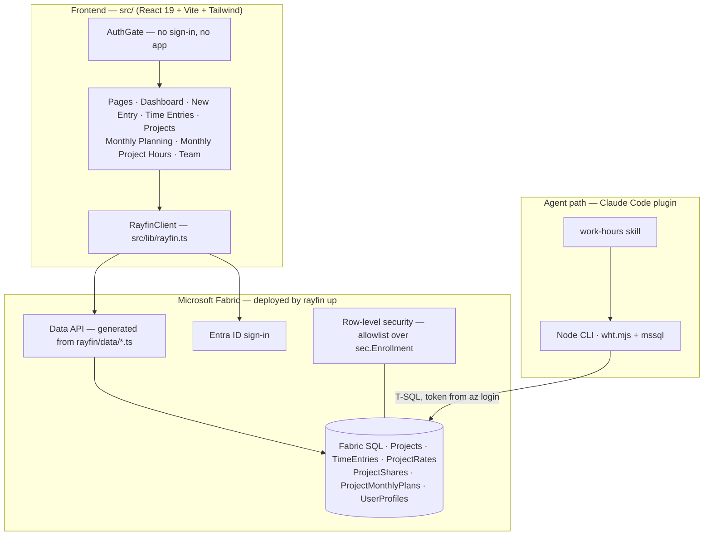

# Technical details — One place for everyone's hours

*The app: every screen, what it is built from, and how it was put together.*

[← back to the story](../work-hour-tracker.md#one-place-for-everyones-hours) · [Portfolio](../../README.md)

---

## 1. The screens

*All screenshots are of the running app, signed in against the demo database. Every note visible in the data begins with `[DEMO]` — that prefix is a property of the seeded dataset, and it is why these screenshots can be published at all.*

**Dashboard** — four KPIs, the week as a bar chart, hours by project in each project's own stored colour, and week-by-week small multiples where hours are *drawn* and money is *written*, so two measures share a card without sharing a scale. All five week cards share one maximum, so the weeks compare honestly.


**Monthly project hours** — the plan/actual view. A scatter of planned against actual with the dashed *actual = planned* diagonal and a least-squares trend line, progress rings that turn rosy when a project goes over plan, and the same numbers again as a table because a gauge is not a figure you can check.


**Time entries** — everything logged, newest first, editable in place. `Edit` rather than delete-and-re-add is a deliberate constraint: re-adding an entry would lose its id, its notes and its [frozen rate](data-model.md#2-money-lives-in-three-places-on-purpose), silently repricing old work at today's rate.


**Projects** — where the rate model becomes visible. The rate is *yours*: everyone on a shared project sets their own, and nobody sees anyone else's. Sharing is a separate act from creating, and the rate you set stays yours whoever else joins.


**Monthly planning** — planned hours per project per month, saved as soon as a cell loses focus.


<details>
<summary>Two more — new entry, and the sign-in gate</summary>

**New time entry.** The rate in force is resolved and frozen onto the row at this moment, which is what makes historical earnings immutable.


**The sign-in gate.** No password is ever handled by this app — sign-in is brokered to Microsoft Entra ID through the Fabric portal.


</details>

---

## 2. Architecture



The frontend is the only part written by hand. The database, the CRUD API, the auth service and the static hosting are generated from the TypeScript entity files in `rayfin/data/` by `rayfin up`.

The agent path on the left is explained in [the agent layer](agentic-layer.md); the row-level security at the bottom in [security](security.md).

---

## 3. Tech stack

| Layer | Tool | Why chosen |
|---|---|---|
| UI | React 19 · Vite · Tailwind 4 | Fast HMR in development and a plain static build that Fabric hosting can serve without a Node server |
| Backend | Rayfin 1.33 (`@microsoft/rayfin-*`) | Entities are declared in TypeScript and compiled into tables plus a CRUD API — no hand-written CRUD to drift out of sync with the schema |
| Auth | Microsoft Entra ID (Fabric brokered sign-in) | The company identity already exists; no password is ever stored or handled |
| Storage | Fabric SQL (MSSQL) | Same tenant and capacity as the app, and reachable by ordinary T-SQL — which is what made the agent path possible at all |
| Agent interface | Claude Code plugin + Node CLI (`mssql`) | Fabric sign-in is irreducibly browser-based (no device-code or service-principal flow), so a terminal tool cannot reuse the app's API and must talk to SQL directly |
| Isolation | SQL row-level security | Enforcement had to live below the API, because the agent path bypasses the app's policies by construction |
| Credentials | `az account get-access-token`, minted per run | Nothing secret at rest: no passwords, no connection secrets in the repo |

---

## 4. How it was built

1. **Declare the data.** Six entities in `rayfin/data/*.ts`, listed in `schema.ts`; backend settings in `rayfin.yml`. What each one holds is in [the data model](data-model.md).
2. **Deploy the backend.** `rayfin up` creates the tables, the Data API, the auth service and the static site; generated settings flow `rayfin/.env` → `.env.local` → the frontend at runtime.
3. **Build the screens.** Dashboard (KPI cards), New Entry, Time Entries, Projects, Monthly Planning, Monthly Project Hours and Team — all behind an `AuthGate`, all data through one `RayfinClient`.
4. **Stamp ownership once.** `src/lib/user.ts` writes the four owner columns on every insert; the CLI mirrors the same logic so both paths agree.
5. **Build the agent path.** A `work-hours` Claude Code skill over `scripts/wht.mjs`: `whoami`, `projects`, `hours`, `summary`, `plans`, `add-entry`, `set-plan`, `edit-entry`, `edit-project`, `delete-entry`, and a read-only `query` escape hatch.
6. **Enforce isolation in SQL.** A row-level policy compiled from `rayfin/data/access.json` and applied with `rls --apply`; `rls --status` reports coverage.
7. **Onboard people.** An admin runs `grant-user --user <email>` once per colleague (table rights only, never `db_owner`); the colleague runs `az login --allow-no-subscriptions`, then `setup` and `whoami`.

---

## 5. Repository structure

```
work-hour-tracker/
├── src/                     frontend (hand-written)
│   ├── pages/               Dashboard · NewTimeEntry · TimeEntries · Projects
│   │                        MonthlyPlanning · MonthlyProjectHours · Team
│   ├── components/          AuthGate · Layout · KpiCard · FormField · ConfirmButton · charts
│   └── lib/                 rayfin.ts (API bridge) · user.ts (owner stamping) · hours.ts · rates.ts
└── rayfin/
    ├── data/                entity declarations + access.json (RLS input)
    └── rayfin.yml           backend settings

agentic-work-tracker/        the Claude Code marketplace + plugin
└── plugins/work-tracker/
    └── skills/work-hours/   SKILL.md + scripts/wht.mjs (the CLI)
```

---

## 6. Running it locally

```bash
# prerequisites: Node.js, Azure CLI, access to the Fabric workspace
az login --allow-no-subscriptions   # Entra-only account: the flag is required
npm install
npm run dev                         # deploys backend changes, then serves the frontend
```

```text
# the agent path, from Claude Code
/plugin marketplace add <org>/agentic-work-tracker
/plugin install work-tracker@agentic-work-tracker
node scripts/wht.mjs setup && node scripts/wht.mjs whoami
```

[← back to the story](../work-hour-tracker.md#one-place-for-everyones-hours) · [Portfolio](../../README.md)
